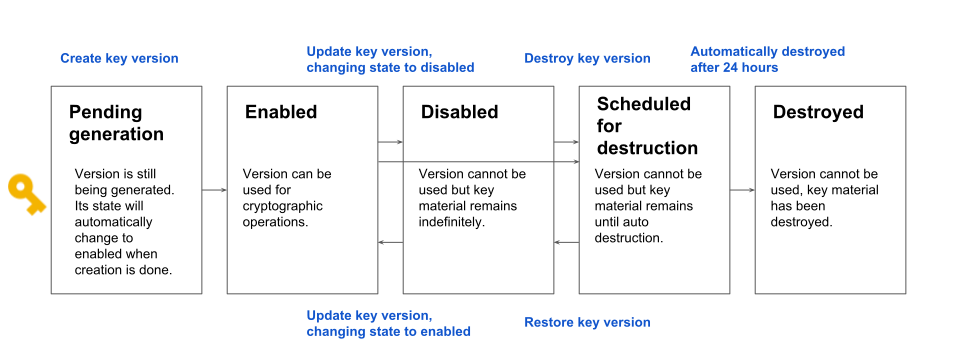

# How to restore KMS cryptokey

## Intro
Cloud Key Management Service (KMS) allows us to create, import, and manage cryptographic keys and perform cryptographic operations in a single centralized cloud service.

We use crypto keys for encrypt/decrypt secrets in terraform repo and liquibase gradle libs.

Crypto key is a named object containing one or more key versions, along with metadata for the key. A key exists on exactly one key ring tied to a specific location.

The key version lifecycle explained below:



## Disabled state
In that state key version may not be used, but the key material is still available, and the version can be placed back into the enabled state.

> :warning:
Disabling a key version is consistent within a range of several seconds up to three hours. Enabling a key version is nearly instant. That means, although a key version in disable state, we could use it up to 3 hours.

Typical error during crypto operation with key version in disabled state:
```sh
ERROR: (gcloud.kms.encrypt) FAILED_PRECONDITION: projects/env-test/locations/europe-west1/keyRings/harrypotter/cryptoKeys/hogwarts/cryptoKeyVersions/1 is not enabled, current state is: DISABLED.
- '@type': type.googleapis.com/google.rpc.PreconditionFailure
  violations:
  - subject: projects/env-test/locations/europe-west1/keyRings/harrypotter/cryptoKeys/hogwarts/cryptoKeyVersions/1
    type: KEY_DISABLED
```

That means, in project env-test key ring harrypotter in location europe-west1 has key hogwarts with disabled version 1.
Steps to enable key version:
1. List key version status:
```sh
$ gcloud beta kms keys versions list \
    --location europe-west1 \
    --keyring harrypotter \
    --key hogwarts \
    --project env-test \
    --format yaml
```

2. Enable key version 1:
```sh
$ gcloud kms keys versions enable 1 \
    --location europe-west1 \
    --keyring harrypotter \
    --key hogwarts \
    --project env-test \
    --format yaml
```
## Scheduled for destruction state
> :warning: 
Destroying a key is a permanent operation that can cause unrecoverable data loss. If you decide that you do not want the destruction to occur, you can restore the key version. However, after 24 hours this action is not reversible. Any data encrypted with this key version will not be recoverable!

Typical error during crypto operation with key version in that state:
```sh
ERROR: (gcloud.kms.decrypt) FAILED_PRECONDITION: projects/env-test/locations/europe-west1/keyRings/harrypotter/cryptoKeys/hogwarts/cryptoKeyVersions/1 is not enabled, current state is: DESTROY_SCHEDULED.
- '@type': type.googleapis.com/google.rpc.PreconditionFailure
  violations:
  - subject: projects/env-test/locations/europe-west1/keyRings/harrypotter/cryptoKeys/hogwarts/cryptoKeyVersions/1
    type: KEY_DESTROY_SCHEDULED
```

That means, in project env-test key ring harrypotter in location europe-west1 has key hogwarts with version 1, that was scheduled to destroy.
Steps to restore key version:
1. List key version status:
```sh
$ gcloud beta kms keys versions list \
    --location europe-west1 \
    --keyring harrypotter \
    --key hogwarts \
    --project env-test12 \
    --format yaml
```
2. Restore key version 1 (key version state will be disabled):
```sh
$ gcloud kms keys versions restore 1 \
    --location europe-west1 \
    --keyring harrypotter \
    --key hogwarts \
    --project env-test
```

3. Enable key version 1:
```sh
$ gcloud kms keys versions enable 1 \
    --location europe-west1 \
    --keyring harrypotter \
    --key hogwarts \
    --project env-test \
    --format yaml
```
## References
https://cloud.google.com/kms/docs

https://cloud.google.com/kms/docs/key-states

https://registry.terraform.io/providers/hashicorp/google/latest/docs/resources/kms_key_ring
